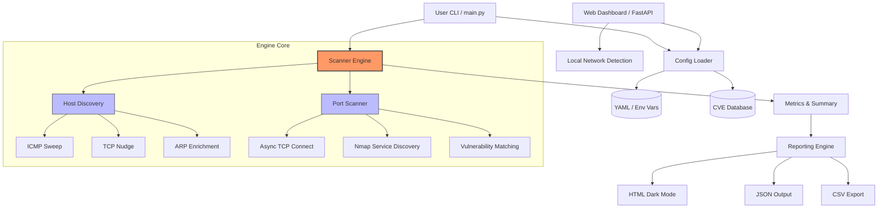

# 🔍 NetScope - Network Vulnerability Scanner - v2.1.0

A production-grade, async network vulnerability scanner built in Python. Designed for security professionals, network administrators, and penetration testers.

> ⚠️ **Legal Notice:** Only scan networks and hosts you own or have **explicit written permission** to test.
> Unauthorized port scanning may violate the Computer Fraud and Abuse Act (CFAA), the Computer Misuse Act, and equivalent laws worldwide.

---

## Table of Contents

1. [Features](#features)
2. [Architecture](#architecture)
3. [Quick Start](#quick-start)
4. [Installation](#installation)
5. [Usage](#usage)
6. [Web Dashboard](#web-dashboard)
7. [Configuration](#configuration)
8. [Host Discovery Engine](#host-discovery-engine)
9. [Reports](#reports)
10. [Testing](#testing)
11. [Deployment](#deployment)
12. [Security Considerations](#security-considerations)
13. [Roadmap](#roadmap)

---

## Features

| Category         | Capability                                                                           |
| ---------------- | ------------------------------------------------------------------------------------ |
| **Scanning**     | High-performance Async TCP connect scan, configurable batching and concurrency       |
| **Discovery**    | **High-Fidelity Engine**: ICMP sweep + **TCP Nudge** + Nmap ARP overlay              |
| **Detection**    | Banner grabbing with dynamic HTTP Host probing, regex-based fingerprinting           |
| **Intelligence** | **CVSS v3.1 Integration**: Local CVE database with authoritative NVD base scores     |
| **Reporting**    | Interactive HTML, JSON, CSV, metadata, and JSON scan diffs                           |
| **Dashboard**    | FastAPI web console with scan launch, local-network auto-detect, live jobs, charts   |
| **Safety**       | CIDR limits (/16), public-target authorization, exclusions, sanitized output         |
| **Ops**          | Rotating logs, YAML configuration, environment variable overrides                    |
| **Testing**      | Unit and async integration test suite (`pytest`); check current coverage locally     |

---

## Architecture



```text
netscope/
├── main.py                    # CLI entry point
├── config/
│   ├── settings.yaml          # Default configuration
│   └── cve_db.csv             # Local CVE database (extensible)
├── src/
│   ├── scanner/
│   │   └── engine.py          # Core: async scanning, Nmap, CVE matching, risk scoring
│   ├── reporting/
│   │   └── reporter.py        # HTML / JSON / CSV exporters
│   ├── dashboard/
│   │   ├── app.py             # FastAPI dashboard API + scan job runner
│   │   └── static/            # Browser dashboard UI
│   └── utils/
│       ├── config.py          # ScanConfig dataclass + env/YAML loader
│       └── log_config.py      # Structured logging (console + rotating file)
├── tests/
│   ├── test_netscope.py       # Core unit tests
│   ├── test_dashboard.py      # Dashboard API, local-network detection, job guard
│   └── test_phase3.py         # Advanced async & end-to-end integration tests (v1.2.0)
├── reports/                   # Generated reports (gitignored)
├── logs/                      # Log files (gitignored)
├── Dockerfile
├── docker-compose.yml
├── requirements.txt
└── requirements-dev.txt
```

### Data Flow

```text
CLI args / config
       │
       ▼
  NetScopeScanner.run() / run_discovery()
       │
       ├── validate_target()        → List[str] of IPs (max /16)
       ├── validate_ports()         → List[int] of ports
       │
       ▼
 [if discovery] → run_discovery()
       ├── async ICMP ping sweep
       └── ARP table enrichment
 [if scan]      → batched execution (per --batch-size)
       │  for host in current_batch:
       ├── scan_host_async()        (asyncio, --concurrency bounded)
       │  per open port:
       │   ├── banner grab (TCP recv + HTTP Host probe)
       │   ├── _try_nmap_scan()     (shared ThreadPoolExecutor)
       │   └── CveDatabase.match()  (family-whitelisted matching)
       │
       ▼
 ScanSummary (metrics: targeted vs responded)
       │
       ▼
 export_all() (HTML / JSON / CSV)
```

---

---

## Quick Start

```bash
# 1. Clone
git clone https://github.com/Ayaan-22/NetScope.git
cd netscope

# 2. Install
python -m pip install -e .
sudo apt-get install nmap   # or: brew install nmap

# 3. Scan your Wi-Fi host IP from any folder
netscope -t 192.168.0.106 --no-nmap --authorize-scan

# 4. Open report
open reports/netscope_*.html

# Or launch the web dashboard
netscope-dashboard --host 127.0.0.1 --port 8765
```

In the dashboard, click **Use My Network** to auto-fill your current private LAN target, then start with the `Common` port profile. Use `Top 1000` or Nmap-heavy scans after a quick baseline, because they can take noticeably longer on a full `/24`.

---

## Installation

### Local (Python 3.10+)

```bash
python -m pip install -e .

# Development install with test/lint/security tools
python -m pip install -e ".[dev]"
```

The editable install registers the `netscope` command, so you can run scans from any directory:

```bash
netscope --help
netscope -t 192.168.0.106 --no-nmap --authorize-scan
```

On Windows, use the Python launcher if `python` is not on your PATH:

```powershell
py -m pip install -e ".[dev]"
Get-Command netscope
```

NetScope resolves the bundled default CVE database automatically when installed this way. If you run `netscope` from `C:\Users\Home` or another folder, CVE matching still loads from the project/install location unless you provide a custom `--cve-db` path.

**System Nmap** (required for service/version detection):

```bash
# Debian / Ubuntu
sudo apt-get install nmap

# macOS
brew install nmap

# Windows
# Download installer from https://nmap.org/download.html
```

> If Nmap is not installed, NetScope falls back gracefully to async TCP scanning only. Pass `--no-nmap` to skip Nmap explicitly.

### Docker

```bash
docker build -t netscope .
docker run --rm --network host netscope -t 192.168.0.106 --no-nmap --authorize-scan
```

---

## Usage

```text
usage: netscope [-h] [-t TARGET] [-p PORTS] [--discover] [--discover-scan] [--timeout SECS]
                [--concurrency N] [--batch-size N] [--no-nmap]
                [--nmap-os-detect] [--nmap-timing {0-5}] [--cve-db PATH]
                [--nmap-timeout SECS] [--nmap-discovery-timeout SECS]
                [--output-dir DIR] [--report-prefix NAME]
                [--formats {html,json,csv} [...]] [--diff REPORT.json]
                [--probe-delay SECS] [--probe-jitter SECS] [--max-results N]
                [--exclude TARGET] [--authorize-scan] [--allow-public-targets]
                [--log-level LEVEL] [--config FILE]
```

### Argument Details

| Flag            | Default         | Description                                              |
| --------------- | --------------- | -------------------------------------------------------- |
| `-t, --target`  | **Required**    | IP, hostname, or CIDR (e.g. `192.168.0.0/24`)            |
| `--discover`    | `false`         | Host discovery only (ping sweep + ARP), no port scan     |
| `--discover-scan` | `false`       | Discover active hosts first, then scan only those hosts  |
| `-p, --ports`   | `common`        | `common`, `top1000`, `all`, or custom list (`22,80,443`) |
| `--timeout`     | `1.5`           | Connection timeout in seconds                            |
| `--concurrency` | `500`           | Max concurrent sockets (per host)                        |
| `--batch-size`  | `20`            | Max hosts scanned in parallel (total batch)              |
| `--probe-delay` | `0`             | Fixed delay before each TCP probe                        |
| `--probe-jitter`| `0`             | Random additional delay before each TCP probe            |
| `--max-results` | `100000`        | Abort if scan output exceeds this many open-port rows    |
| `--no-nmap`     | `false`         | Skip Nmap service/version enrichment                     |
| `--nmap-os-detect` | `false`      | Enable Nmap OS detection (`-O`); usually requires root/CAP_NET_RAW |
| `--nmap-timeout` | `120`          | Timeout for each Nmap enrichment chunk                   |
| `--nmap-discovery-timeout` | `15` | Timeout for the Nmap discovery booster                   |
| `--exclude`     | _(none)_        | Exclude an IP, hostname, or CIDR; repeatable             |
| `--diff`        | _(none)_        | Compare the new JSON report with a previous JSON report  |
| `--authorize-scan` | `false`      | Acknowledge authorization for the target                 |
| `--allow-public-targets` | `false` | Permit public targets; requires authorization            |
| `--config`      | `settings.yaml` | Path to YAML config file                                 |

### Examples

```bash
# Single host, default common ports
python main.py -t 192.168.0.106 --no-nmap --authorize-scan

# Installed CLI command, runnable from any directory
netscope -t 192.168.0.106 --no-nmap --authorize-scan

# Wi-Fi subnet with custom ports
python main.py -t 192.168.0.0/24 -p 22,80,443,8080-8090 --no-nmap --authorize-scan

# Fast Wi-Fi host discovery - no port scanning
python main.py -t 192.168.0.0/24 --discover --no-nmap --authorize-scan

# Wi-Fi LAN discovery + scan, skipping the Nmap discovery booster
netscope -t 192.168.0.0/24 --discover-scan --no-nmap --ports common --formats html json --authorize-scan

# Wi-Fi LAN discovery + scan with the Nmap booster capped at 10 seconds
netscope -t 192.168.0.0/24 --discover-scan --nmap-discovery-timeout 10 --ports common --formats html json --authorize-scan

# Exclude the Wi-Fi gateway/router
netscope -t 192.168.0.0/24 --exclude 192.168.0.1 --discover-scan --no-nmap --ports common --formats html json --authorize-scan

# VirtualBox / host-only adapter subnet
netscope -t 192.168.56.0/24 --discover-scan --no-nmap --ports common --formats html json --authorize-scan

# VMware VMnet1 and VMnet8 adapter subnets
netscope -t 192.168.145.0/24 --discover-scan --no-nmap --ports common --formats html json --authorize-scan
netscope -t 192.168.223.0/24 --discover-scan --no-nmap --ports common --formats html json --authorize-scan

# Full Wi-Fi network scan (all ports)
python main.py -t 192.168.0.0/24 -p all --no-nmap --authorize-scan

# Top 1000 ports, skip Nmap, HTML report only
python main.py -t 192.168.0.106 --ports top1000 --no-nmap --formats html --authorize-scan

# High-performance Wi-Fi LAN scan (parallelise 100 hosts at once)
python main.py -t 192.168.0.0/24 --batch-size 100 --concurrency 1000 --no-nmap --authorize-scan

# Quiet mode, debug logging to file
python main.py -t 192.168.0.106 --log-level WARNING --no-nmap --authorize-scan

# Custom configuration and output
python main.py -t 192.168.0.106 --config custom_prod.yaml --output-dir ./final_scans --no-nmap --authorize-scan

# Public targets require explicit authorization
python main.py -t 203.0.113.10 --authorize-scan --allow-public-targets

# Exclude a host and produce a diff against the previous report
python main.py -t 192.168.0.0/24 --exclude 192.168.0.1 --formats json html --diff reports/previous.json --no-nmap --authorize-scan

# Skip the Nmap discovery booster if it is slow on your network
python main.py -t 192.168.0.0/24 --discover-scan --no-nmap --ports common --formats html json --authorize-scan
```

### Your Local Networks

The dashboard can detect the active private IPv4 network for you. Click **Use My Network** in the scan form and NetScope will fill the target, enable the authorization acknowledgement, and keep public-target scanning disabled.

If you prefer the CLI, these are common local/lab target patterns:

| Adapter | Your host IP | Scan target |
| ------- | ------------ | ----------- |
| Wi-Fi | `192.168.0.106` | `192.168.0.0/24` |
| Ethernet / host-only | `192.168.56.1` | `192.168.56.0/24` |
| VMware VMnet1 | `192.168.145.1` | `192.168.145.0/24` |
| VMware VMnet8 | `192.168.223.1` | `192.168.223.0/24` |

Start with the Wi-Fi target for your real LAN. Use VMware or host-only targets only when the VMs/lab machines you want to test are attached to those adapters.

### Port Specifications

| Spec              | Meaning                       |
| ----------------- | ----------------------------- |
| `common`          | 25 well-known ports (default) |
| `top1000`         | Top ~1000 ports (nmap-style)  |
| `all`             | All 65,535 TCP ports          |
| `80`              | Single port                   |
| `22,80,443`       | Comma-separated list          |
| `1-1024`          | Range                         |
| `22,80,8000-8090` | Mixed                         |

---

## Web Dashboard

Run the dashboard locally:

```bash
netscope-dashboard --host 127.0.0.1 --port 8765
```

Then open:

```text
http://127.0.0.1:8765
```

Dashboard capabilities:

- Browser-based scan launcher with target, port profile, Nmap, discovery, exclusions, and authorization controls.
- **Use My Network** detection for the current private IPv4 LAN, with a selector when multiple adapters are present.
- Active job guard: the dashboard runs one scan at a time so long LAN scans do not accidentally stack.
- Live job list for queued, discovery, scanning, exporting, completed, and failed stages.
- Report history sourced from `reports/*.json`.
- Summary metrics for hosts, open ports, vulnerabilities, unique CVEs, and high-risk hosts.
- Canvas charts for severity mix, exposed services, and risk bands.
- Searchable, sortable, severity-filtered results table with an evidence panel.
- Direct access to generated HTML, JSON, and CSV report artifacts.

The dashboard uses the same scanner engine, safety validation, CVE database, and report exporters as the CLI.

### Dashboard Workflow

1. Start the server with `netscope-dashboard --host 127.0.0.1 --port 8765`.
2. Open `http://127.0.0.1:8765`.
3. Click **Use My Network** to fill the current LAN target automatically.
4. Leave `Public targets` off for private LAN scanning.
5. Start with `Common` ports. Enable `Top 1000`, `All TCP`, or Nmap enrichment only when you are ready for longer scans.

### Dashboard Logs

Dashboard-launched scans write progress to `logs/netscope.log`, including scan start, discovery/scanning stages, report export, completion, and failures. If a job appears slow, check the job card stage first, then inspect the log:

```powershell
Get-Content logs\netscope.log -Tail 80
```

---

## Configuration

### YAML (`config/settings.yaml`)

```yaml
timeout: 1.5
concurrency: 500
host_batch_size: 20
probe_delay: 0.0
probe_jitter: 0.0
max_results: 100000
use_nmap: true
nmap_os_detect: false
nmap_timing: 4
nmap_timeout: 120
nmap_discovery_timeout: 15
cve_db_path: config/cve_db.csv
output_dir: reports
report_prefix: netscope
report_formats: [html, json, csv]
log_level: INFO
authorized_scan: false
allow_public_targets: false
exclude_hosts: []
```

### Precedence Order

NetScope applies configuration in the following order (highest priority wins):

1. **Command Line Arguments** (`--timeout 2.0`)
2. **Environment Variables** (`NETSCOPE_TIMEOUT=2.0`)
3. **YAML Config File** (`timeout: 2.0`)
4. **Hard-coded Defaults** (`1.5`)

### Environment Variables

All settings can be overridden via env vars (useful for Docker/CI):

| Variable               | Default             | Description                    |
| ---------------------- | ------------------- | ------------------------------ |
| `NETSCOPE_TIMEOUT`     | `1.5`               | Per-port TCP timeout (seconds) |
| `NETSCOPE_CONCURRENCY` | `500`               | Max async connections          |
| `NETSCOPE_PROBE_DELAY` | `0`                 | Fixed delay before each probe  |
| `NETSCOPE_PROBE_JITTER` | `0`                | Random additional probe delay  |
| `NETSCOPE_MAX_RESULTS` | `100000`           | Open-port row safety ceiling   |
| `NETSCOPE_USE_NMAP`    | `1`                 | Set to `0` to disable Nmap     |
| `NETSCOPE_NMAP_TIMING` | `4`                 | Nmap timing template (0–5)     |
| `NETSCOPE_NMAP_OS_DETECT` | `0`              | Set to `1` to enable Nmap `-O` |
| `NETSCOPE_NMAP_TIMEOUT` | `120`             | Per Nmap chunk timeout         |
| `NETSCOPE_NMAP_DISCOVERY_TIMEOUT` | `15`    | Nmap discovery booster timeout |
| `NETSCOPE_AUTHORIZED_SCAN` | `0`             | Authorization acknowledgement  |
| `NETSCOPE_ALLOW_PUBLIC_TARGETS` | `0`        | Permit public target ranges    |
| `NETSCOPE_EXCLUDE_HOSTS` | _(empty)_         | Comma-separated exclusions     |
| `NETSCOPE_CVE_DB`      | `config/cve_db.csv` | Path to CVE database           |
| `NETSCOPE_OUTPUT_DIR`  | `reports`           | Report output directory        |
| `NETSCOPE_LOG_LEVEL`   | `INFO`              | Logging level                  |

### CVE Database Format

The CVE database is a plain CSV file at `config/cve_db.csv`.
You can extend it with your own entries or import from NVD exports.

When using the installed `netscope` command, the default `config/cve_db.csv` is resolved from the project/install location, not from the current PowerShell directory. This means the following works from any folder:

```powershell
cd C:\Users\Home
netscope -t 192.168.0.106 --no-nmap --ports common --formats html json --authorize-scan
```

Use `--cve-db` or `NETSCOPE_CVE_DB` only when you want to load a different CSV:

```powershell
netscope -t 192.168.0.106 --cve-db C:\path\to\custom_cve_db.csv --authorize-scan
```

```csv
service,version,cve_id,description,severity
ssh,7.2,CVE-2016-0777,OpenSSH 7.2 roaming connection memory disclosure,High
ssh,*,CVE-2023-38408,OpenSSH remote code execution via ssh-agent,Critical
http,*,CVE-2021-41773,Apache 2.4.49 path traversal and RCE,Critical
```

- **`version`**: Use `*` to match known versions only, or a numeric token like `7.2` to match version-boundary strings such as `7.2p1`.
- **`severity`**: `Critical` / `High` / `Medium` / `Low` / `Info`
- **`service`**: Lowercase service name matching banner detection output (e.g., `http`, `ssh`, `mysql`)

---

## Host Discovery Engine

The `--discover` flag provides a multi-layered, high-fidelity discovery sweep designed to map modern networks where standard pings are often blocked by mobile devices (iOS/Android) and hardened workstations.

### Multi-Layer Discovery Logic

1. **ICMP Ping Sweep**: Parallel async pings for foundational host enumeration.
2. **TCP Nudge Strategy**: Attempts sub-second TCP connections to common ports (80, 443, 22, 5353, 62078). A response (SYN-ACK) or even a refusal (**RST**) provides a definitive "UP" signal and forces the target's MAC address into the system's ARP cache.
3. **Nmap ARP Overlay**: If Nmap is installed, NetScope leverages its advanced discovery heuristics to find hosts that traditional methods might miss.
4. **ARP Cache Resolution**: Reads the local ARP table to resolve MAC addresses and confirm host presence even if the host hides from active probes.

**Example:**

```bash
python main.py -t 192.168.0.0/24 --discover --no-nmap --authorize-scan
```

Output includes:

- **IP Address**: The resolved IPv4.
- **MAC Address**: Resolved via the nudged ARP cache.
- **Hostname**: Resolved via reverse DNS.

## Reports

Three formats are generated on every scan (all to `reports/`):

### HTML Report

Browser-viewable report features:

- **Risk Score Cards**: Quick scan summary of critical findings.
- **CVSS v3.1 Badges**: Automated NVD score matching (e.g., `Critical`, `High`).
- **Interactive Results Table**: Search and sort by host, port, service, version, and risk.
- **Technical Evidence**: Full banner evidence and service versioning.
- **Reproducibility Metadata**: Session ID, tool version, command, config path/hash, and authorization flags.

### JSON Report

Machine-readable, suitable for ingestion into SIEMs, dashboards, or CI pipelines. Now includes explicit host metrics.

```json
{
  "meta": {
    "target": "192.168.0.0/24",
    "hosts_targeted": 254,
    "hosts_with_results": 3,
    "total_vulnerabilities": 8,
    "session_id": "a generated UUID",
    "tool_version": "2.1.0",
    "command": "python main.py ...",
    "scan_start": "2026-04-18T00:00:01",
    "scan_end": "2026-04-18T00:00:45"
  },
  "results": [
    { "host": "192.168.0.1", "port": 22, "service": "ssh", "risk_score": 8.5,
      "vulnerabilities": [{ "cve_id": "CVE-2023-38408", "severity": "Critical", ... }] }
  ]
}
```

### CSV Report

One row per open port. Importable into Excel, Splunk, or any SIEM. Fields include: Host, Port, Service, Version, Risk Score, CVE Count, and Banner.

### Diff Report

Use `--diff previous.json` with JSON output to produce a `.diff.json` report containing newly opened ports, closed ports, new CVEs, resolved CVEs, and risk-score changes.

---

## Testing

```bash
# With pytest installed:
pytest tests/ -v --tb=short

# Coverage report:
pytest tests/ --cov=src --cov-report=term-missing

# Full local quality gate:
ruff check .
mypy src main.py
bandit -q -r src main.py
pip-audit -r requirements.txt -r requirements-dev.txt
```

### Test Coverage

| Module                 | Tests                                                                |
| ---------------------- | -------------------------------------------------------------------- |
| `validate_target`      | valid IP, CIDR /30, network too large, empty, invalid                |
| `validate_ports`       | list, range, mixed, dedup, port 0, inverted range                    |
| `identify_service`     | SSH/HTTP/FTP banner match, port fallback, unknown                    |
| `parse_version`        | semver, 3-part, version keyword, no match                            |
| `calculate_risk_score` | empty, severity fallback, CVSS score path, capped at 10              |
| `CveDatabase`          | wildcard match, version-boundary match, no match, family match       |
| Async scanner          | open port detected with real server, closed port ignored, multi-port |
| Reports                | HTML escaping, JSON/CSV sanitization, metadata                       |
| Dashboard              | API health/defaults, reports, file serving, local-network detection, active-job guard |
| Diffing                | new/closed ports, new/resolved CVEs, risk changes                    |
| Safety                 | public target authorization and exclusions                           |

---

## Deployment

### Docker (Recommended)

```bash
# Build
docker build -t netscope:latest .

# Single scan
docker run --rm --network host \
  -v $(pwd)/reports:/app/reports \
  netscope:latest -t 192.168.0.0/24 --discover-scan --no-nmap --authorize-scan

```

### Docker Compose

```bash
# Edit docker-compose.yml to set your target, then:
docker compose run netscope -t 192.168.0.0/24 --discover-scan --no-nmap --formats html json --authorize-scan
```

### CI / Scheduled Scanning

```yaml
# .github/workflows/scan.yml
- name: Run NetScope
  run: |
      docker run --rm --network host \
        -v ${{ github.workspace }}/reports:/app/reports \
        netscope:latest -t ${{ secrets.SCAN_TARGET }} \
        --formats json
- name: Upload Report
  uses: actions/upload-artifact@v3
  with:
      name: scan-report
      path: reports/
```

### Recommended Production Configuration

```yaml
# High-accuracy LAN scan
timeout: 2.0
concurrency: 300      # Lower if hitting rate limits / firewalls
nmap_timing: 3        # Slightly slower, more accurate
use_nmap: true
authorized_scan: true

# Fast internet-facing scan
timeout: 3.0
concurrency: 50       # Be polite on WAN
probe_delay: 0.05
probe_jitter: 0.10
nmap_timing: 2
use_nmap: false
authorized_scan: true
allow_public_targets: true
```

---

## Security Considerations

1. **Run as non-root** unless Nmap SYN scanning is required (`NET_RAW` capability). The Docker image uses a dedicated `netscope` user.
2. **Never scan targets you don't own.** Store written authorisation alongside scan reports.
3. **Public targets are gated.** Use both `--authorize-scan` and `--allow-public-targets` for public IP ranges.
4. **Rate-limit on WAN.** Keep `--concurrency` low and use `--probe-delay` / `--probe-jitter` to avoid overwhelming small devices.
5. **Protect reports.** Reports contain sensitive infrastructure data. Store them in access-controlled directories; the `reports/` folder is gitignored by default.
6. **CVE DB is local.** The bundled database is a starting point. For production, sync against NVD or a commercial feed.

---

## Roadmap

- [x] Async performance optimization (batched host scanning)
- [x] Configurable concurrency and batch sizes
- [x] Hardened service-family CVE matching logic
- [x] Async integration testing for core scan/report paths
- [ ] Distributed Deployments: Worker topology for massive cross-subnet sweeps on enterprise estates.
- [ ] Time-Series Subnet Analysis: Identify anomalous behavior (impromptu port openings) over sustained periods.
- [ ] Response Extensibility: Automated triggering of rapid verification scripts based on discovered CVE profiles.
- [ ] UDP scanning support
- [ ] gRPC / REST API mode for integration into security dashboards
- [x] Web dashboard (FastAPI) for interactive scanning, report analytics, and evidence review
