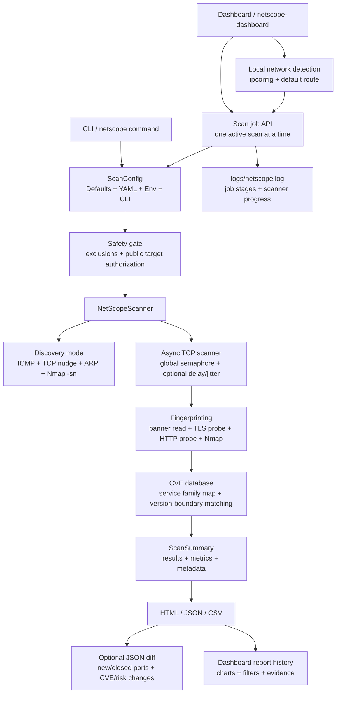

# NetScope Architecture

NetScope is a single-process async scanner with optional Nmap enrichment, local CVE matching, and a FastAPI dashboard for browser-driven scans.

## Safety Boundary

The CLI refuses public IP targets unless the operator supplies both `--authorize-scan` and `--allow-public-targets`. Multicast, unspecified, and reserved addresses are blocked. Use `--exclude` for gateways, fragile devices, printers, or systems outside the authorized scope.

## Concurrency Model

`host_batch_size` controls how many hosts are scheduled at once. `concurrency` is enforced through one global TCP probe semaphore, so the total number of active socket attempts is bounded across the whole scan rather than multiplied per host.

The dashboard accepts one active scan at a time. This prevents accidental overlap between expensive LAN sweeps such as `Top 1000` plus Nmap enrichment on a full `/24`.

## Dashboard

The FastAPI dashboard serves a static browser UI and JSON APIs for defaults, local-network detection, scan jobs, report history, report details, and report file downloads. The **Use My Network** action detects active private IPv4 networks from Windows `ipconfig` and a socket default-route fallback, then fills the scan target for the operator.

Dashboard job records expose stages such as queued, discovery, scanning, exporting, completed, and failed. Dashboard-launched scans initialize the same rotating file logger as the CLI, so progress and failures are available in `logs/netscope.log`.

## Fingerprinting

The scanner first attempts to read an immediate banner. Known TLS ports use a TLS handshake probe instead of receiving a cleartext HTTP request. Known HTTP ports receive a `HEAD /` probe with the target host in the `Host` header. Nmap service/version enrichment is optional and chunked to avoid dropping ports.

## Reporting

Reports include a session ID, tool version, command, config path/hash, scanner hostname, timestamps, and authorization metadata. JSON is the canonical machine-readable format; HTML is for review; CSV is spreadsheet/SIEM-friendly and sanitized against formula injection.
